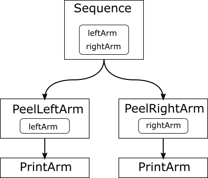
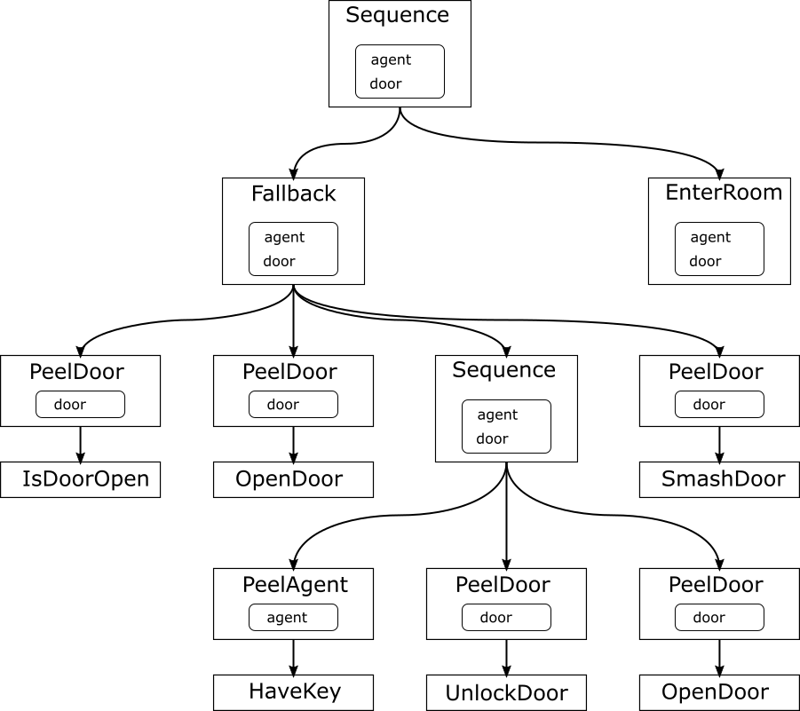

# tiny_behavior_tree (Rust crate)
An experimental Rust crate to support behavior tree in minimal footprint


## Overview

This project is an attempt of direct port of [TinyBehaviorTree](https://github.com/msakuta/TinyBehaviorTree),
which was inspired by [BehaviorTreeCPP](https://github.com/BehaviorTree/BehaviorTree.CPP.git).

The name was converted to snake_case to conform to Rust crate naming convention.

## Motivation

For the motivation why we would like to experiment things like this, see [TinyBehaviorTree's README](https://github.com/msakuta/TinyBehaviorTree/blob/master/README.md).

The problem with implementation in C++ is that it's not trivial to write deserialization code to convert settings file into a whole behavior tree dynamically.
Without deserialization, TinyBehaviorTree is just a fancy way to write
function call tree.
With Rust's rich reflection and serialization ecosystem (serde),
we can hope that it can be achieved much more easily.


## How it looks like

The usage is very similar to TinyBehaviorTree.

First, you define the state with a data structure.

```rust
struct Arm {
    name: String,
}

struct Body {
    left_arm: Arm,
    right_arm: Arm,
}

let body = Body {
    left_arm: Arm {
        name: "leftArm".to_string(),
    },
    right_arm: Arm {
        name: "rightArm".to_string(),
    },
};
```

Then, you define a behavior tree.

```rust
let mut tree = SequenceNode::<&Body, (), (), _>::new(
    [
        boxify(PeelLeftArmNode(PrintArmNode)),
        boxify(PeelRightArmNode(PrintArmNode)),
    ],
);
```

and call `tree.tick()`

```rust
let result = tree.tick(&body);
```

## How to define your own node

The core of the library is the `BehaviorNodeBase` trait.
It is generic trait with 3 type parameters, i.e.
`BehaviorNodeBase<Payload, R, F>`.

* `Payload` is the type that is input into this node.
* `R` is the result type that will be returned on success.
* `F` is the result type that will be returned on failure.

This library uses generic parameters to specify information to pass down to each node's tick() function.
Unlike C++, Rust doesn't have variadic templates, so you need to stuff the arguments into a tuple if you want to pass multiple arguments.

```rust
struct PrintArmNode;

impl BehaviorNodeBase<&Arm, (), ()> for PrintArmNode {
    fn tick(&mut self, arm: &Arm) -> BehaviorResult {
        println!("arm: {}", arm.name);
        BehaviorResult::SUCCESS(())
    }
}
```

The `R` and `F` types work like `Result<T, E>` type in standard library, but this library has its own result type with more variants.

```rust
pub enum BehaviorResult<R, F> {
    Idle,
    Running,
    Success(R),
    Failure(F),
}
```

## Heterogeneous tree

Even if you have nodes with different argument types, you can compose them into a single
tree using "Peel" nodes, that will transform data in the parent node into what
a child node can accept.
We call this node PeelNode because usually child node sees smaller view of parent node's accessible data.

Suppose we are developing two-armed robot and want to design a behavior node that processes
either one of the arms.
The data we are passing to the entire tree is like this

```rust
struct Arm {
    name: String,
}

struct Body {
    left_arm: Arm,
    right_arm: Arm,
}
```

We can define the node to process an arm:

```rust
struct PrintArmNode;

impl BehaviorNodeBase<&Arm, (), ()> for PrintArmNode {
    fn tick(&mut self, arm: &Arm) -> BehaviorResult {
        println!("arm: {}", arm.name);
        BehaviorResult::SUCCESS(())
    }
}
```

But the entire tree should accept Body as the argument.
How do we do it?

The answer is to define PeelNodes for left and right arms.

## peel_node_def macro

There is a macro `peel_node_def` to simplify this process.

```rust
peel_node_def!(PeelLeftArmNode, Body, Arm, (), (), |payload: &'a Body| &payload.left_arm);
peel_node_def!(PeelRightArmNode, Body, Arm, (), (), |payload: &'a Body| &payload.right_arm);
```

### Arguments

This macro has 6 arguments, which is a lot compared to average macros.

* name: The name of the newly defined peel node.
* parent_payload: The type of the payload given to the parent node.
* payload: The type of the payload given to the child node.
* r: The type of success result.
* f: The type of failure result.
* peel: The logic (defined as a lambda expression) to convert a reference to the parent node to child node.

You need to specify a reference with lifetime `'a` to `peel`
lambda expression's argument type.
For example, if you specify a type `Payload` to the second argument, it should be `&'a Payload`.
This is because the macro expands to a generic impl with <'a>.

Interestingly, Rust's macros are hygienic about identifier names, but not about lifetimes.

### Usage

Once you define these PeelNodes, you can use them to compose the same `PrintArmNode` to
both arms.

```rust
let mut tree = SequenceNode::<&Body, (), (), _>::new(
    [
        boxify(PeelLeftArmNode(PrintArmNode)),
        boxify(PeelRightArmNode(PrintArmNode)),
    ],
);
```

The tree structure will be:

* tree
  * SequenceNode
    * PeelLeftArm
      * PrintArmNode
    * PeelRightNode
      * PrintArmNode



And the output of `tree.tickRoot()` will be:

    leftArm
    rightArm

## FallbackNode

We can compose Fallback node as well.
Here is a more complex example with Fallback node,
which you can find the source code in [tests/full_scenario.rs](tests/full_scenario.rs).



## TODO

* Asynchronous nodes/coroutines
* Dynamic reconfiguration with configuration file
